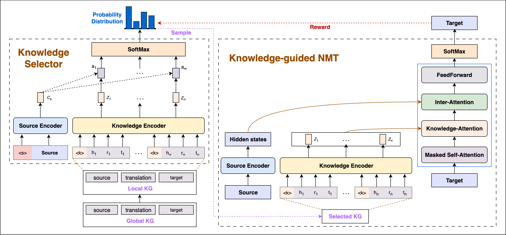
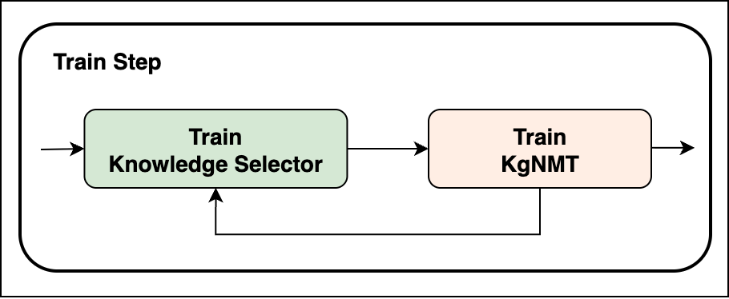

# Dynamic KgNMT

Dynamic KgNMT is a research project on **Neural Machine Translation (NMT)** based on the **Transformer architecture**, extended with **Knowledge Graph (KG) integration**.  
This project re-implements the approach on **[fairseq](https://github.com/facebookresearch/fairseq)** and evaluates it on the **IWSLT 2015 En–Vi dataset**. We also use the wikidata-5m KG dataset for providing knowledge to translastion task.



We also apply a different train loop, where we will alternately train 2 components Knowledge-Selector and KgNMT.
<p align="center">
  
</p>

---

## 🚀 Installation

### 1. Environment setup
We recommend using [conda](https://docs.conda.io/projects/conda/en/stable/user-guide/install/index.html):

```bash
conda create -n kltn2025
conda activate kltn2025
conda install python=3.10
conda install pip=23.2.1
```

### 2. Required libraries
```bash
pip install numpy==1.23.5 
pip install torch==1.13.1 torchvision==0.14.1 torchaudio==0.13.1
pip install sentence_transformers
```

Install [spaCy](https://spacy.io/usage) following the official documentation.

### 3. Install fairseq (modified version in this repo)
```bash
cd src/dynamic-kgnmt-fairseq
pip install --editable ./
pip install fastBPE sacremoses subword_nmt sentencepiece
```

---

## 📂 Data Structure
### Parallel data (translation)
```
src/dynamic-kgnmt-fairseq/en-vi-dynamic-kgnmt/kgnmt_data/
    ├── train.en
    ├── train.vi
    ├── valid.en
    ├── valid.vi
    ├── test.en
    ├── test.vi
```

### Knowledge Graph data
```
src/extract-local-kg/data-kg/
    ├── kg_trans.txt
    ├── wikidata5m_all_triplet.txt
    ├── wikidata5m_entity.txt
    ├── wikidata5m_relation.txt
```

---

## ⚙️ Local KG Extraction
Two methods are supported:

### 1. Similarity-based (for English KG and En–Vi KG translation)

```bash
cd src/extract-local-kg/similar
chmod +x similar_extract.sh
./similar_extract.sh
```

### 2. NER-based (only for English KG)

- Using pretrained BERT:

```bash
cd src/extract-local-kg/ner
chmod +x bert_ner_extract.sh
./bert_ner_extract.sh
```

- Using spaCy:

```bash
chmod +x spacy_ner_extract.sh
./spacy_ner_extract.sh
```

---

## 🏋️‍♂️ Training & Evaluation

### Prepare the data
Organize the dataset as follows:

```
en-vi-dynamic-kgnmt/kgnmt_data/
    ├── train.en | train.vi | train.kg
    ├── valid.en | valid.vi | valid.kg
    ├── test.en  | test.vi  | test.kg
```

### Run the full pipeline
```bash
cd src/dynamic-kgnmt-fairseq/en-vi-dynamic-kgnmt
chmod +x dynamic_kgnmgt_flow.sh
./dynamic_kgnmgt_flow.sh
```

### Run individual stages
1. Data preprocessing

```bash
chmod +x prepare_dynamic_kgnmt_envi.sh
./prepare_dynamic_kgnmt_envi.sh
# processed data will be saved in data-bin/envi-bpe
```

2. Training

```bash
chmod +x train_dynamic_kgnmt_envi.sh
./train_dynamic_kgnmt_envi.sh
# checkpoints are saved in checkpoints/envi-dynamic-kgnmt
```

3. Evaluation

```bash
chmod +x eval_dynamic_kgnmt_envi.sh
./eval_dynamic_kgnmt_envi.sh
# results: output/generate-test.txt
```

---

## 📌 Notes
Training parameters and detailed configs are defined inside the .sh scripts.

Rename the checkpoint folder (checkpoints/envi-dynamic-kgnmt) for each run to avoid overwriting.

---

## 📖 Reference
This project is based on the original paper on Dynamic Knowledge Graph for Neural Machine Translation and re-implemented on fairseq.